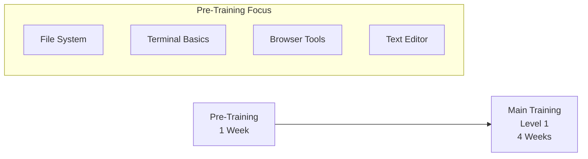
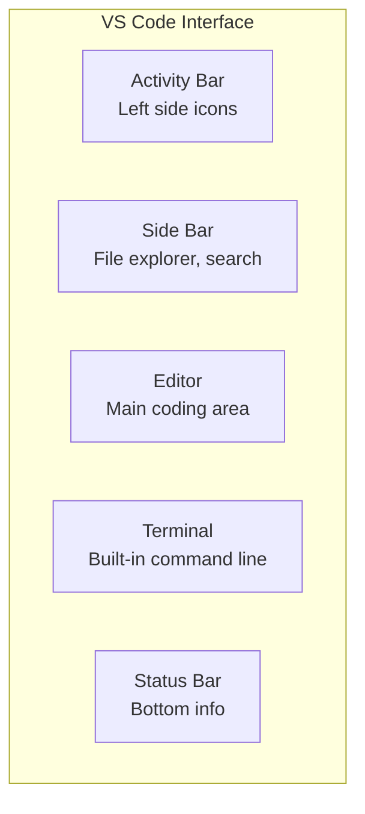

# Pre-Training Program for Level 1 Trainees

**Target Audience:** Trainees who scored 0-12 on the assessment  
**Duration:** 1 week (5 days), 1.5 hours per day  
**Goal:** Build foundational computer skills before starting main automation testing training

---

## Overview

This pre-training program addresses gaps in basic computer skills that are essential for the main training. Completing this program ensures trainees can focus on automation concepts without struggling with fundamental computer operations.



---

## Day 1: File System Fundamentals

### Learning Objectives

- Understand file and folder structure
- Navigate file system confidently
- Perform basic file operations

### Session Content

**Part 1: Understanding File System (30 min)**

| Concept | Explanation |
|---------|-------------|
| File | A single document (text, image, code) |
| Folder/Directory | A container that holds files or other folders |
| Path | The "address" of a file (e.g., `Desktop/Training/notes.txt`) |
| Extension | File type indicator (e.g., `.txt`, `.py`, `.html`) |

**Part 2: Hands-on Practice (45 min)**

Exercise 1: File Organization
```
Create this structure on your Desktop:
Training/
├── week-1/
│   ├── notes.txt
│   └── exercises/
├── week-2/
└── resources/
```

Exercise 2: File Operations
- Create, rename, copy, move, and delete files
- Use keyboard shortcuts: `Cmd+C`, `Cmd+V`, `Cmd+X`, `Cmd+Z`

**Part 3: Review & Quiz (15 min)**

Quiz Questions:
1. What is the difference between a file and a folder?
2. How do you undo an action?
3. What does the `.txt` extension mean?

### Homework

Create a folder structure for a hypothetical project with at least 3 levels of nesting.

---

## Day 2: Terminal/Command Line Basics

### Learning Objectives

- Open and use Terminal
- Execute basic navigation commands
- Understand command structure

### Session Content

**Part 1: Introduction to Terminal (30 min)**

What is Terminal?
- A text-based interface to control your computer
- More powerful than clicking around
- Essential for development work

**Part 2: Essential Commands (45 min)**

| Command | Purpose | Example |
|---------|---------|---------|
| `pwd` | Print current directory | `pwd` → `/Users/thai/Desktop` |
| `ls` | List files in directory | `ls` → shows files |
| `cd` | Change directory | `cd Training` |
| `mkdir` | Create new folder | `mkdir my-folder` |
| `touch` | Create new file | `touch notes.txt` |
| `clear` | Clear terminal screen | `clear` |

**Part 3: Hands-on Practice (15 min)**

Exercise: Terminal Navigation
```bash
# Open Terminal and try these commands:
pwd
ls
mkdir TerminalPractice
cd TerminalPractice
touch hello.txt
ls
cd ..
```

### Homework

Using Terminal only (no mouse), create the same folder structure from Day 1.

---

## Day 3: Web Browser & Developer Tools

### Learning Objectives

- Use browser efficiently
- Open and navigate Developer Tools
- Inspect web page elements

### Session Content

**Part 1: Browser Basics (20 min)**

Essential Browser Knowledge:
- Tabs and windows
- Address bar vs search bar
- Bookmarks
- Browser history
- Private/Incognito mode

**Part 2: Developer Tools Introduction (40 min)**

How to Open:
- Press `F12` or `Cmd+Option+I` (Mac)
- Right-click → "Inspect"

Key Panels:

| Panel | Purpose |
|-------|---------|
| Elements | View/edit HTML structure |
| Console | See errors, run JavaScript |
| Network | Monitor page requests |
| Sources | View page source code |

**Part 3: Hands-on Practice (30 min)**

Exercise 1: Inspect Elements
1. Go to google.com
2. Open Developer Tools
3. Click the "Select element" tool (arrow icon)
4. Click on the search box
5. Observe the highlighted HTML

Exercise 2: Console Exploration
1. Open Console tab
2. Type `console.log("Hello World")` and press Enter
3. Try `1 + 1` and see the result

### Homework

Visit 3 different websites and use Developer Tools to find:
- The main heading (h1) of each page
- Any error messages in Console

---

## Day 4: Text Editor Setup (VS Code)

### Learning Objectives

- Install and configure VS Code
- Navigate the VS Code interface
- Create and edit files

### Session Content

**Part 1: Installation (20 min)**

Steps:
1. Download VS Code from code.visualstudio.com
2. Install the application
3. Open and explore the welcome screen

**Part 2: VS Code Interface (40 min)**



Key Areas:
- **Activity Bar**: Switch between Explorer, Search, Source Control
- **Side Bar**: File tree, search results
- **Editor**: Where you write code
- **Integrated Terminal**: `Ctrl+`` to open

Essential Shortcuts:

| Shortcut | Action |
|----------|--------|
| `Cmd+S` | Save file |
| `Cmd+P` | Quick open file |
| `Cmd+Shift+P` | Command palette |
| `Cmd+/` | Toggle comment |
| `Cmd+D` | Select next occurrence |

**Part 3: Hands-on Practice (30 min)**

Exercise: First Project
1. Create folder `my-first-project`
2. Open folder in VS Code (`File → Open Folder`)
3. Create file `readme.md`
4. Write some text
5. Save the file
6. Create file `hello.py`
7. Write `print("Hello World")`

### Homework

Customize VS Code:
- Change color theme (Settings → Color Theme)
- Install "Python" extension

---

## Day 5: Putting It All Together

### Learning Objectives

- Combine all learned skills
- Set up a practice project
- Prepare for main training

### Session Content

**Part 1: Review Quiz (30 min)**

Written Assessment:
1. How do you create a folder using Terminal?
2. What keyboard shortcut opens Developer Tools?
3. How do you save a file in VS Code?
4. What is a file path?
5. Name 3 basic Terminal commands.

**Part 2: Integration Exercise (45 min)**

Complete Project Setup:
```bash
# In Terminal:
cd Desktop
mkdir automation-practice
cd automation-practice
mkdir tests
mkdir pages
touch README.md

# Then in VS Code:
# Open the automation-practice folder
# Create these files:
# - tests/test_example.py
# - pages/home_page.py
# - config.py
```

**Part 3: Preparation for Main Training (15 min)**

Environment Check:
- [ ] VS Code installed
- [ ] Can open Terminal in VS Code
- [ ] Can create files and folders
- [ ] Can use Developer Tools
- [ ] Python extension installed in VS Code

Next Steps:
- Main training starts next week
- Focus on Python basics and Playwright
- Bring questions from homework

---

## Pre-Training Completion Checklist

| Skill | Demonstrated |
|-------|--------------|
| Create/navigate folders using File Explorer | ☐ |
| Create/navigate folders using Terminal | ☐ |
| Use keyboard shortcuts (copy, paste, save) | ☐ |
| Open Developer Tools in browser | ☐ |
| Inspect HTML elements | ☐ |
| Create files in VS Code | ☐ |
| Use VS Code integrated terminal | ☐ |

**Trainer Sign-off:** ____________________

**Date:** ____________________

---

## Resources

**Terminal Practice:**
- https://www.codecademy.com/learn/learn-the-command-line

**VS Code:**
- https://code.visualstudio.com/docs/getstarted/tips-and-tricks

**Browser DevTools:**
- https://developer.chrome.com/docs/devtools/overview/
