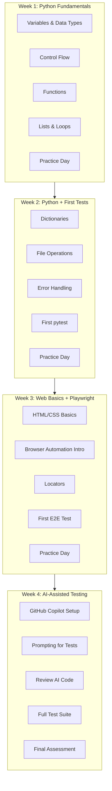

# Training Plan: Level 1 (Foundation Builder)

**Target Audience:** Trainees who scored 0-12 on assessment (after completing pre-training)  
**Duration:** 4 weeks, 1.5 hours per day (20 sessions)  
**Prerequisites:** Completed Pre-Training Program  
**Tech Stack:** Python + Playwright + GitHub Copilot

---

## Training Philosophy

This plan prioritizes **confidence building** over speed. Every concept is reinforced through multiple exercises before moving forward. AI (GitHub Copilot) is introduced early as a learning companion, not a replacement for understanding.



---

## Week 1: Python Fundamentals

### Day 1: Variables and Data Types

**Learning Objectives:**
- Understand what variables are
- Work with strings, numbers, and booleans

**Session Breakdown:**

| Time | Activity |
|------|----------|
| 0:00-0:20 | Concept: Variables as "labeled boxes" |
| 0:20-0:50 | Hands-on: Create variables, print them |
| 0:50-1:20 | Exercise: Simple calculator |
| 1:20-1:30 | Review and Q&A |

**Hands-on Exercise:**
```python
# exercise_01_variables.py
# Create these variables:
name = "Your Name"
age = 25
is_student = True

# Print them:
print("My name is", name)
print("I am", age, "years old")
print("Am I a student?", is_student)

# Challenge: Calculate your age in months
age_in_months = age * 12
print("That's", age_in_months, "months!")
```

**Homework:** Create variables for 5 different facts about yourself.

---

### Day 2: Control Flow (if/else)

**Learning Objectives:**
- Make decisions in code
- Use comparison operators

**Key Concepts:**

| Operator | Meaning | Example |
|----------|---------|---------|
| `==` | Equal to | `age == 25` |
| `!=` | Not equal | `name != "Bob"` |
| `>` `<` | Greater/Less | `score > 50` |
| `>=` `<=` | Greater/Less or Equal | `age >= 18` |

**Hands-on Exercise:**
```python
# exercise_02_conditions.py
age = int(input("Enter your age: "))

if age >= 18:
    print("You are an adult")
else:
    print("You are a minor")

# Challenge: Add condition for senior (65+)
```

**Homework:** Create a simple login checker (username and password).

---

### Day 3: Functions

**Learning Objectives:**
- Create reusable code blocks
- Understand parameters and return values

**Analogy:** Functions are like recipes - you define them once, use them many times.

**Hands-on Exercise:**
```python
# exercise_03_functions.py
def greet(name):
    """Say hello to someone"""
    return f"Hello, {name}!"

def add(a, b):
    """Add two numbers"""
    return a + b

# Use the functions:
message = greet("Thai")
print(message)

result = add(5, 3)
print("5 + 3 =", result)

# Challenge: Create a function that checks if a number is even
```

**Homework:** Create 3 functions of your own choice.

---

### Day 4: Lists and Loops

**Learning Objectives:**
- Store multiple values in lists
- Iterate with for loops

**Hands-on Exercise:**
```python
# exercise_04_loops.py
fruits = ["apple", "banana", "orange", "mango"]

# Print all fruits
for fruit in fruits:
    print(f"I like {fruit}")

# Add a fruit
fruits.append("grape")

# Loop with index
for i, fruit in enumerate(fruits):
    print(f"{i + 1}. {fruit}")

# Challenge: Find the longest fruit name
```

**Homework:** Create a list of 10 items and practice adding, removing, sorting.

---

### Day 5: Week 1 Practice Day

**Activities:**
1. Review quiz (15 min)
2. Code challenges (45 min)
3. Pair exercise with trainer (30 min)

**Code Challenges:**
```python
# Challenge 1: FizzBuzz
# Print numbers 1-30
# If divisible by 3, print "Fizz"
# If divisible by 5, print "Buzz"
# If divisible by both, print "FizzBuzz"

# Challenge 2: Simple Grade Calculator
# Input: score (0-100)
# Output: Grade (A, B, C, D, F)

# Challenge 3: Shopping List Manager
# - Add items
# - Remove items
# - Show all items
# - Count items
```

---

## Week 2: Python Intermediate + First Tests

### Day 6: Dictionaries

**Learning Objectives:**
- Store key-value pairs
- Access and modify dictionary data

**Analogy:** Dictionaries are like contact books - you look up by name (key), get info (value).

**Hands-on Exercise:**
```python
# exercise_06_dict.py
user = {
    "name": "Thai",
    "email": "thai@example.com",
    "age": 30,
    "is_active": True
}

# Access values
print(user["name"])
print(user.get("email"))

# Add/modify
user["role"] = "Tester"
user["age"] = 31

# Loop through dictionary
for key, value in user.items():
    print(f"{key}: {value}")
```

---

### Day 7: File Operations

**Learning Objectives:**
- Read from files
- Write to files

**Hands-on Exercise:**
```python
# exercise_07_files.py
# Writing
with open("test_data.txt", "w") as f:
    f.write("user1,password1\n")
    f.write("user2,password2\n")

# Reading
with open("test_data.txt", "r") as f:
    content = f.read()
    print(content)

# Reading line by line
with open("test_data.txt", "r") as f:
    for line in f:
        print(line.strip())
```

---

### Day 8: Error Handling

**Learning Objectives:**
- Handle errors gracefully with try/except
- Understand common error types

**Hands-on Exercise:**
```python
# exercise_08_errors.py
def divide(a, b):
    try:
        result = a / b
        return result
    except ZeroDivisionError:
        print("Cannot divide by zero!")
        return None
    except TypeError:
        print("Please provide numbers only!")
        return None

# Test it
print(divide(10, 2))   # Works
print(divide(10, 0))   # ZeroDivisionError
print(divide("10", 2)) # TypeError
```

---

### Day 9: First pytest

**Learning Objectives:**
- Understand what a test is
- Write first pytest test
- Run tests

**Hands-on Exercise:**
```python
# calculator.py
def add(a, b):
    return a + b

def subtract(a, b):
    return a - b

# test_calculator.py
from calculator import add, subtract

def test_add():
    assert add(2, 3) == 5
    assert add(-1, 1) == 0

def test_subtract():
    assert subtract(5, 3) == 2
    assert subtract(0, 5) == -5
```

Run tests:
```bash
pytest test_calculator.py -v
```

---

### Day 10: Week 2 Practice Day

**Focus:** Testing mindset

**Exercises:**
1. Write tests for a shopping cart class
2. Practice test naming conventions
3. Debug failing tests

---

## Week 3: Web Basics + Playwright Introduction

### Day 11: HTML/CSS Basics

**Learning Objectives:**
- Understand HTML structure
- Identify common elements
- Use DevTools to inspect elements

**Key HTML Elements for Testing:**

| Element | Purpose | Example |
|---------|---------|---------|
| `<input>` | Text fields, buttons | `<input type="text" id="username">` |
| `<button>` | Clickable buttons | `<button id="submit">Login</button>` |
| `<a>` | Links | `<a href="/about">About Us</a>` |
| `<div>` | Container | `<div class="form-group">` |
| `<form>` | Form wrapper | `<form action="/login">` |

**Hands-on:** Use DevTools on 3 websites, identify login form elements.

---

### Day 12: Browser Automation Introduction

**Learning Objectives:**
- Understand what Playwright does
- Install Playwright
- Run first automation

**Setup:**
```bash
pip install pytest-playwright
playwright install
```

**First Script:**
```python
# first_automation.py
from playwright.sync_api import sync_playwright

with sync_playwright() as p:
    browser = p.chromium.launch(headless=False)
    page = browser.new_page()
    
    page.goto("https://www.google.com")
    page.wait_for_timeout(3000)  # Wait 3 seconds
    
    browser.close()
```

---

### Day 13: Locators

**Learning Objectives:**
- Find elements on page
- Use different locator strategies

**Locator Strategies (Priority Order):**

| Strategy | When to Use | Example |
|----------|-------------|---------|
| `get_by_role` | Best - semantic | `page.get_by_role("button", name="Login")` |
| `get_by_text` | Visible text | `page.get_by_text("Sign in")` |
| `get_by_label` | Form fields | `page.get_by_label("Email")` |
| `get_by_placeholder` | Input hints | `page.get_by_placeholder("Enter email")` |
| `locator` (CSS) | Fallback | `page.locator("#submit-btn")` |

**Hands-on Exercise:** Locate 10 elements on a practice site.

---

### Day 14: First E2E Test

**Learning Objectives:**
- Write complete E2E test
- Use assertions

**Hands-on Exercise:**
```python
# test_search.py
from playwright.sync_api import Page, expect

def test_google_search(page: Page):
    # Navigate
    page.goto("https://www.google.com")
    
    # Find search box and type
    page.get_by_role("combobox").fill("Playwright testing")
    
    # Press Enter
    page.keyboard.press("Enter")
    
    # Verify results appear
    expect(page.get_by_role("main")).to_be_visible()
```

---

### Day 15: Week 3 Practice Day

**Project:** Automate a simple login flow on a practice site.

Practice Sites:
- https://the-internet.herokuapp.com/login
- https://practicetestautomation.com/practice-test-login/

---

## Week 4: AI-Assisted Testing with GitHub Copilot

### Day 16: GitHub Copilot Setup

**Learning Objectives:**
- Install and configure GitHub Copilot
- Understand how it works
- First AI-assisted code

**Setup Steps:**
1. Install GitHub Copilot extension in VS Code
2. Sign in with GitHub account
3. Enable Copilot Chat

**First Experience:**
```python
# Type this comment and wait for Copilot suggestion:
# Function to check if email is valid

# Copilot will suggest something like:
def is_valid_email(email):
    import re
    pattern = r'^[\w\.-]+@[\w\.-]+\.\w+$'
    return re.match(pattern, email) is not None
```

---

### Day 17: Prompting for Tests

**Learning Objectives:**
- Write effective prompts for test generation
- Use Copilot Chat for test ideas

**Effective Prompts:**

| Bad Prompt | Good Prompt |
|------------|-------------|
| "Write a test" | "Write a Playwright test that verifies login with valid credentials on /login page" |
| "Test this" | "Write pytest tests for this function covering: valid input, empty input, invalid type" |

**Hands-on Exercise:**

Prompt Practice:
```
# Use Copilot Chat with these prompts:

1. "Generate a Playwright test for logging into 
   https://the-internet.herokuapp.com/login 
   with username 'tomsmith' and password 'SuperSecretPassword!'"

2. "Write negative test cases for a login form"

3. "Create a Page Object class for a login page with 
   username input, password input, and login button"
```

---

### Day 18: Reviewing AI-Generated Code

**Learning Objectives:**
- Critically evaluate AI suggestions
- Identify common AI mistakes
- Improve generated code

**Review Checklist:**

| Check | What to Look For |
|-------|------------------|
| ✅ Correctness | Does it do what was asked? |
| ✅ Locators | Are locators reliable? |
| ✅ Assertions | Are assertions meaningful? |
| ✅ Readability | Is code clear and maintainable? |
| ✅ Error Handling | What if element not found? |
| ✅ Hardcoded Values | Should data be parameterized? |

**Exercise:** Review 5 AI-generated tests, list improvements for each.

---

### Day 19: Building a Full Test Suite

**Learning Objectives:**
- Combine all skills
- Create organized test suite
- Use AI efficiently

**Project Structure:**
```
test-project/
├── tests/
│   ├── test_login.py
│   ├── test_search.py
│   └── test_checkout.py
├── pages/
│   ├── login_page.py
│   └── search_page.py
├── conftest.py
└── pytest.ini
```

**Hands-on:** Build test suite for a practice e-commerce site with AI assistance.

---

### Day 20: Final Assessment

**Assessment Components:**

| Component | Weight | Description |
|-----------|--------|-------------|
| Written Quiz | 20% | Concepts and terminology |
| Code Review | 30% | Review and improve AI code |
| Live Coding | 30% | Write test with AI assistance |
| Project | 20% | Complete test suite |

**Success Criteria:**
- [ ] Can write basic Python code independently
- [ ] Can navigate and inspect web pages
- [ ] Can write Playwright tests with AI assistance
- [ ] Can identify issues in AI-generated code
- [ ] Can run and debug tests

---

## Weekly Checkpoints

| Week | Checkpoint |
|------|------------|
| Week 1 | Write a Python program with functions and loops |
| Week 2 | Write and run pytest tests for a class |
| Week 3 | Automate a 3-step user flow with Playwright |
| Week 4 | Create a test suite using AI assistance |

---

## Resources

**Python:**
- Python.org Tutorial: https://docs.python.org/3/tutorial/

**Playwright:**
- Official Docs: https://playwright.dev/python/docs/intro

**GitHub Copilot:**
- Getting Started: https://docs.github.com/en/copilot/getting-started-with-github-copilot

**Practice Sites:**
- https://the-internet.herokuapp.com/
- https://automationexercise.com/
