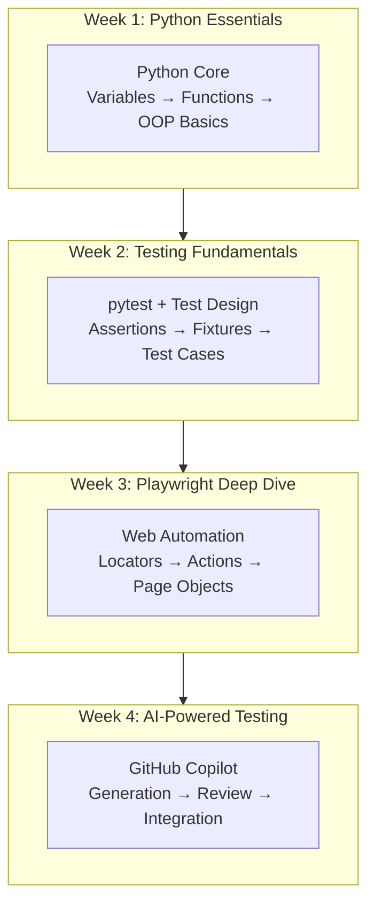

# Training Plan: Level 2 (Standard Track)

**Target Audience:** Trainees who scored 13-24 on assessment  
**Duration:** 4 weeks, 1.5 hours per day (20 sessions)  
**Prerequisites:** Basic computer skills, logical thinking  
**Tech Stack:** Python + Playwright + GitHub Copilot

---

## Training Philosophy

Level 2 trainees have foundational skills but need structured learning. This plan balances concept introduction with practical application, moving at a steady pace with regular reinforcement.



---

## Week 1: Python Essentials (Accelerated)

### Day 1: Python Quick Start

**Learning Objectives:**
- Python syntax refresher
- Variables, data types, operators
- Control flow (if/else, loops)

**Session Flow:**
- Concept overview (30 min)
- Hands-on coding (45 min)
- Exercises (15 min)

**Hands-on Exercise:**
```python
# Complete these tasks:

# 1. Create a list of test user data
users = [
    {"name": "Alice", "role": "admin", "active": True},
    {"name": "Bob", "role": "user", "active": False},
    {"name": "Charlie", "role": "user", "active": True}
]

# 2. Filter only active users
active_users = [u for u in users if u["active"]]

# 3. Get names of all admins
admin_names = [u["name"] for u in users if u["role"] == "admin"]

# 4. Count users by role
from collections import Counter
role_count = Counter(u["role"] for u in users)
```

---

### Day 2: Functions and Modules

**Learning Objectives:**
- Write reusable functions
- Use parameters and return values
- Import and organize code

**Hands-on Exercise:**
```python
# utils/validators.py
def validate_email(email: str) -> bool:
    """Check if email format is valid"""
    return "@" in email and "." in email

def validate_password(password: str) -> dict:
    """Check password meets requirements"""
    return {
        "length": len(password) >= 8,
        "has_upper": any(c.isupper() for c in password),
        "has_digit": any(c.isdigit() for c in password)
    }

# main.py
from utils.validators import validate_email, validate_password

email = "test@example.com"
print(f"Email valid: {validate_email(email)}")

pwd_check = validate_password("MyPass123")
print(f"Password check: {pwd_check}")
```

---

### Day 3: Object-Oriented Basics

**Learning Objectives:**
- Understand classes and objects
- Create simple classes
- Use inheritance basics

**Why OOP for Testing?**
- Page Object Model uses classes
- Test data as objects
- Reusable test components

**Hands-on Exercise:**
```python
# models/user.py
class User:
    def __init__(self, username: str, email: str, role: str = "user"):
        self.username = username
        self.email = email
        self.role = role
        self.is_active = True
    
    def deactivate(self):
        self.is_active = False
    
    def is_admin(self) -> bool:
        return self.role == "admin"
    
    def __str__(self):
        return f"User({self.username}, {self.role})"

# Usage
admin = User("thai", "thai@example.com", "admin")
print(admin)
print(f"Is admin: {admin.is_admin()}")
```

---

### Day 4: Working with Data

**Learning Objectives:**
- Read/write JSON and CSV
- Handle external test data
- Data-driven testing prep

**Hands-on Exercise:**
```python
import json
import csv

# JSON handling
test_data = {
    "valid_users": [
        {"username": "user1", "password": "pass123"},
        {"username": "user2", "password": "pass456"}
    ],
    "invalid_users": [
        {"username": "", "password": "pass123"},
        {"username": "user1", "password": ""}
    ]
}

# Write JSON
with open("test_data.json", "w") as f:
    json.dump(test_data, f, indent=2)

# Read JSON
with open("test_data.json", "r") as f:
    loaded_data = json.load(f)

# CSV handling
with open("users.csv", "w", newline="") as f:
    writer = csv.DictWriter(f, fieldnames=["username", "password"])
    writer.writeheader()
    writer.writerows(test_data["valid_users"])
```

---

### Day 5: Week 1 Mini-Project

**Project:** Build a User Management Module

Requirements:
- User class with validation
- Load users from JSON
- Filter/search capabilities
- Unit tests (preview)

---

## Week 2: Testing Fundamentals

### Day 6: Introduction to pytest

**Learning Objectives:**
- pytest structure and conventions
- Write effective assertions
- Run and interpret tests

**pytest Basics:**
```python
# test_basics.py
import pytest

# Simple test
def test_addition():
    assert 1 + 1 == 2

# Test with description
def test_string_contains():
    """Verify string contains expected text"""
    message = "Hello, World!"
    assert "World" in message

# Test that expects exception
def test_division_by_zero():
    with pytest.raises(ZeroDivisionError):
        result = 10 / 0
```

**Running Tests:**
```bash
pytest -v                    # Verbose output
pytest -v -k "login"         # Run tests with "login" in name
pytest --tb=short            # Shorter traceback
pytest -x                    # Stop on first failure
```

---

### Day 7: Test Organization and Fixtures

**Learning Objectives:**
- Organize tests effectively
- Use fixtures for setup/teardown
- Share fixtures across tests

**Fixture Examples:**
```python
# conftest.py
import pytest
from models.user import User

@pytest.fixture
def sample_user():
    """Provide a standard test user"""
    return User("testuser", "test@example.com")

@pytest.fixture
def admin_user():
    """Provide an admin test user"""
    return User("admin", "admin@example.com", "admin")

@pytest.fixture
def user_list():
    """Provide list of test users"""
    return [
        User("user1", "user1@example.com"),
        User("user2", "user2@example.com"),
        User("admin", "admin@example.com", "admin")
    ]

# test_user.py
def test_user_creation(sample_user):
    assert sample_user.username == "testuser"
    assert sample_user.is_active

def test_admin_check(admin_user):
    assert admin_user.is_admin()

def test_filter_admins(user_list):
    admins = [u for u in user_list if u.is_admin()]
    assert len(admins) == 1
```

---

### Day 8: Test Design Principles

**Learning Objectives:**
- Write meaningful test cases
- Cover positive and negative scenarios
- Understand test coverage

**Test Case Categories:**

| Category | Purpose | Example |
|----------|---------|---------|
| Happy Path | Normal use | Valid login succeeds |
| Negative | Invalid input | Empty password fails |
| Boundary | Edge values | Password exactly 8 chars |
| Error | Error handling | Network failure handled |

**Hands-on Exercise:**
```python
# Design test cases for a login function
"""
Function: login(username, password) -> bool

Test Cases to Write:
1. Valid credentials → True
2. Invalid password → False
3. Invalid username → False
4. Empty username → False
5. Empty password → False
6. Username too long (>50 chars) → ?
7. Special characters in username → ?
8. SQL injection attempt → ?
"""
```

---

### Day 9: Parameterized Tests

**Learning Objectives:**
- Run same test with different data
- Reduce test code duplication
- Data-driven testing

**Hands-on Exercise:**
```python
import pytest

@pytest.mark.parametrize("email,expected", [
    ("user@example.com", True),
    ("user@domain.co.uk", True),
    ("user.name@example.com", True),
    ("invalid-email", False),
    ("@example.com", False),
    ("user@", False),
    ("", False),
])
def test_email_validation(email, expected):
    from utils.validators import validate_email
    assert validate_email(email) == expected

@pytest.mark.parametrize("a,b,expected", [
    (2, 3, 5),
    (0, 0, 0),
    (-1, 1, 0),
    (100, 200, 300),
])
def test_addition(a, b, expected):
    assert a + b == expected
```

---

### Day 10: Week 2 Mini-Project

**Project:** Test Suite for Calculator Module

Requirements:
- Calculator class with add, subtract, multiply, divide
- Comprehensive test coverage
- Parameterized tests for multiple inputs
- Edge case handling (division by zero)

---

## Week 3: Playwright Web Automation

### Day 11: Web Fundamentals for Testing

**Learning Objectives:**
- HTML structure understanding
- CSS selectors
- DevTools mastery

**Quick Reference:**

| HTML Element | CSS Selector | Role |
|--------------|--------------|------|
| `<input id="email">` | `#email` | Text input |
| `<button class="submit">` | `.submit` | Button |
| `<a href="/login">` | `a[href="/login"]` | Link |
| `<div data-testid="form">` | `[data-testid="form"]` | Container |

**DevTools Exercise:** Inspect 5 websites, identify selectors for key elements.

---

### Day 12: Playwright Basics

**Learning Objectives:**
- Setup and configuration
- Navigation and basic actions
- Screenshots and video

**Setup and First Test:**
```python
# conftest.py
import pytest
from playwright.sync_api import Page

@pytest.fixture(scope="session")
def browser_context_args(browser_context_args):
    return {
        **browser_context_args,
        "viewport": {"width": 1280, "height": 720}
    }

# test_navigation.py
def test_homepage_loads(page: Page):
    page.goto("https://the-internet.herokuapp.com")
    assert page.title() == "The Internet"

def test_navigation_to_login(page: Page):
    page.goto("https://the-internet.herokuapp.com")
    page.click("text=Form Authentication")
    assert "/login" in page.url
```

---

### Day 13: Locators and Actions

**Learning Objectives:**
- Modern locator strategies
- User interactions
- Waiting strategies

**Locator Priority:**
```python
# Best practices - Use in this order:

# 1. Role-based (most reliable)
page.get_by_role("button", name="Submit")
page.get_by_role("textbox", name="Email")
page.get_by_role("link", name="Sign up")

# 2. Text-based
page.get_by_text("Welcome back")
page.get_by_label("Email address")
page.get_by_placeholder("Enter password")

# 3. Test ID (when available)
page.get_by_test_id("login-form")

# 4. CSS Selector (fallback)
page.locator("#email-input")
page.locator(".submit-button")
```

**Actions:**
```python
# Common actions
page.fill("#username", "testuser")        # Type text
page.click("button[type='submit']")       # Click
page.check("#remember-me")                # Check checkbox
page.select_option("select#country", "US") # Select dropdown
page.press("#search", "Enter")            # Keyboard
```

---

### Day 14: Page Object Model

**Learning Objectives:**
- Organize test code with POM
- Create maintainable page classes
- Separate concerns

**Implementation:**
```python
# pages/login_page.py
from playwright.sync_api import Page, expect

class LoginPage:
    URL = "https://the-internet.herokuapp.com/login"
    
    def __init__(self, page: Page):
        self.page = page
        self.username_input = page.get_by_label("Username")
        self.password_input = page.get_by_label("Password")
        self.login_button = page.get_by_role("button", name="Login")
        self.flash_message = page.locator("#flash")
    
    def navigate(self):
        self.page.goto(self.URL)
    
    def login(self, username: str, password: str):
        self.username_input.fill(username)
        self.password_input.fill(password)
        self.login_button.click()
    
    def expect_success_message(self):
        expect(self.flash_message).to_contain_text("You logged into")
    
    def expect_error_message(self):
        expect(self.flash_message).to_contain_text("Your username is invalid")

# test_login.py
from pages.login_page import LoginPage

def test_valid_login(page):
    login_page = LoginPage(page)
    login_page.navigate()
    login_page.login("tomsmith", "SuperSecretPassword!")
    login_page.expect_success_message()

def test_invalid_login(page):
    login_page = LoginPage(page)
    login_page.navigate()
    login_page.login("invalid", "invalid")
    login_page.expect_error_message()
```

---

### Day 15: Week 3 Mini-Project

**Project:** Automate Login Feature

Requirements:
- Page Object for login page
- Positive and negative test cases
- Parameterized credentials
- Clear assertions

---

## Week 4: AI-Assisted Testing

### Day 16: GitHub Copilot Setup

**Learning Objectives:**
- Install and configure Copilot
- Understand capabilities and limitations
- First AI-assisted code

**Configuration:**
1. Install GitHub Copilot extension
2. Install GitHub Copilot Chat extension
3. Sign in with GitHub account
4. Configure settings (enable/disable for specific languages)

**First Exercise:**
```python
# Let Copilot help complete these:

# 1. Write a comment describing what you need
# Function to validate phone number format

# 2. Start typing and let Copilot suggest
def validate_phone(

# 3. Use Copilot Chat
# Open chat (Ctrl+Shift+I) and ask:
# "Generate test cases for a login function"
```

---

### Day 17: Effective Prompting

**Learning Objectives:**
- Write clear, specific prompts
- Use context effectively
- Iterate on suggestions

**Prompt Templates:**

```python
# For generating tests:
"""
Generate Playwright test for {page_name} that:
- Navigates to {url}
- Fills {field_name} with {value}
- Clicks {button_name}
- Verifies {expected_result}
Use Page Object Model pattern.
"""

# For generating page objects:
"""
Create a Page Object class for {page_url} with:
- Locators for: {list_elements}
- Methods for: {list_actions}
- Assertions for: {list_verifications}
"""

# For test data:
"""
Generate test data for {feature} including:
- Valid cases: {describe}
- Invalid cases: {describe}
- Edge cases: {describe}
Output as Python dict.
"""
```

---

### Day 18: Reviewing AI Code

**Learning Objectives:**
- Critical evaluation of AI output
- Identify common mistakes
- Improve and refactor

**Review Checklist:**

| Area | Questions to Ask |
|------|------------------|
| **Correctness** | Does it match requirements? |
| **Locators** | Are they reliable? Will they break easily? |
| **Waits** | Does it wait for elements properly? |
| **Assertions** | Are assertions meaningful and complete? |
| **Readability** | Is the code clear and maintainable? |
| **Reusability** | Can components be reused? |
| **Edge Cases** | Are error scenarios handled? |

**Exercise:** Take AI-generated tests, identify 3 improvements for each.

---

### Day 19: Integration Project

**Learning Objectives:**
- Combine manual and AI-assisted coding
- Build complete test suite
- Apply best practices

**Project:** E-commerce Test Suite

```
Structure:
├── tests/
│   ├── test_login.py
│   ├── test_search.py
│   ├── test_cart.py
│   └── test_checkout.py
├── pages/
│   ├── base_page.py
│   ├── login_page.py
│   ├── search_page.py
│   └── cart_page.py
├── data/
│   └── test_data.json
├── conftest.py
└── pytest.ini
```

Use Copilot for:
- Generating initial page object structure
- Creating test data
- Writing test cases

Then review and improve each component.

---

### Day 20: Final Assessment

**Assessment Structure:**

| Component | Weight | Task |
|-----------|--------|------|
| Quiz | 20% | Python, pytest, Playwright concepts |
| Code Review | 25% | Review AI-generated test, list improvements |
| Live Coding | 30% | Write test with AI assistance for given scenario |
| Project Review | 25% | Present mini-project, explain decisions |

**Competency Checklist:**
- [ ] Write Python functions and classes
- [ ] Create pytest tests with fixtures and parameters
- [ ] Implement Page Object Model
- [ ] Use Playwright locators effectively
- [ ] Generate tests using GitHub Copilot
- [ ] Review and improve AI-generated code
- [ ] Debug failing tests

---

## Weekly Summary

| Week | Focus | Key Deliverable |
|------|-------|-----------------|
| 1 | Python Essentials | User Management Module |
| 2 | Testing Fundamentals | Calculator Test Suite |
| 3 | Playwright | Login Automation with POM |
| 4 | AI-Assisted Testing | E-commerce Test Suite |

---

## Resources

**Python:**
- Real Python: https://realpython.com/

**pytest:**
- Official Docs: https://docs.pytest.org/

**Playwright:**
- Python Docs: https://playwright.dev/python/

**GitHub Copilot:**
- Best Practices: https://docs.github.com/en/copilot/using-github-copilot/best-practices-for-using-github-copilot
