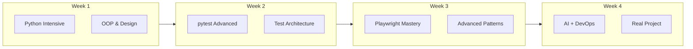

# Training Plan: Level 3 (Accelerated Track)

**Target Audience:** Trainees who scored 25-40 on assessment  
**Duration:** 4 weeks, 1.5 hours per day (20 sessions)  
**Prerequisites:** Strong logical thinking, computer proficiency, self-motivated  
**Tech Stack:** Python + Playwright + GitHub Copilot

---

## Training Philosophy

Level 3 trainees learn fast and need challenge. This plan moves quickly through fundamentals and dedicates more time to advanced concepts, real-world patterns, and independent problem-solving.



---

## Week 1: Python Intensive

### Day 1: Python Power Features

**Objectives:** Master list comprehensions, generators, decorators

**Content:**

```python
# List Comprehensions - Beyond Basics
users = [{"name": "Alice", "role": "admin"}, {"name": "Bob", "role": "user"}]

# Nested comprehension
matrix = [[j for j in range(5)] for i in range(3)]

# Dictionary comprehension
user_roles = {u["name"]: u["role"] for u in users}

# Conditional expressions
labels = ["admin" if u["role"] == "admin" else "standard" for u in users]

# Generators - Memory efficient
def test_data_generator(count):
    for i in range(count):
        yield {"id": i, "name": f"user_{i}"}

# Use generator
for user in test_data_generator(1000):
    # Process without loading all into memory
    pass
```

---

### Day 2: Decorators and Context Managers

**Objectives:** Write custom decorators, understand context management

**Content:**

```python
import functools
import time
from contextlib import contextmanager

# Decorator for timing
def timer(func):
    @functools.wraps(func)
    def wrapper(*args, **kwargs):
        start = time.time()
        result = func(*args, **kwargs)
        end = time.time()
        print(f"{func.__name__} took {end - start:.2f}s")
        return result
    return wrapper

# Decorator with parameters
def retry(times=3, delay=1):
    def decorator(func):
        @functools.wraps(func)
        def wrapper(*args, **kwargs):
            for attempt in range(times):
                try:
                    return func(*args, **kwargs)
                except Exception as e:
                    if attempt < times - 1:
                        time.sleep(delay)
                    else:
                        raise
        return wrapper
    return decorator

# Context manager for test setup
@contextmanager
def test_environment():
    print("Setting up test environment")
    yield {"env": "test", "debug": True}
    print("Tearing down test environment")

# Usage
@timer
@retry(times=3)
def flaky_test():
    pass

with test_environment() as config:
    print(config)
```

---

### Day 3: Object-Oriented Design Patterns

**Objectives:** Factory, Singleton, Strategy patterns for testing

**Content:**

```python
from abc import ABC, abstractmethod
from dataclasses import dataclass
from typing import Protocol

# Factory Pattern - User creation
@dataclass
class User:
    id: int
    name: str
    email: str
    role: str = "user"

class UserFactory:
    _counter = 0
    
    @classmethod
    def create_user(cls, role: str = "user") -> User:
        cls._counter += 1
        return User(
            id=cls._counter,
            name=f"user_{cls._counter}",
            email=f"user{cls._counter}@test.com",
            role=role
        )
    
    @classmethod
    def create_admin(cls) -> User:
        return cls.create_user(role="admin")
    
    @classmethod
    def create_batch(cls, count: int) -> list[User]:
        return [cls.create_user() for _ in range(count)]

# Strategy Pattern - Different test strategies
class TestStrategy(Protocol):
    def execute(self, page) -> bool: ...

class SmokeTesting:
    def execute(self, page) -> bool:
        # Quick critical path tests
        return True

class RegressionTesting:
    def execute(self, page) -> bool:
        # Full test suite
        return True

class TestRunner:
    def __init__(self, strategy: TestStrategy):
        self.strategy = strategy
    
    def run(self, page):
        return self.strategy.execute(page)
```

---

### Day 4: Type Hints and Data Classes

**Objectives:** Strong typing, dataclasses, pydantic for test data

**Content:**

```python
from dataclasses import dataclass, field
from typing import Optional, List
from pydantic import BaseModel, validator

# Dataclasses
@dataclass
class TestCase:
    name: str
    steps: List[str]
    expected: str
    priority: str = "medium"
    tags: List[str] = field(default_factory=list)
    
    def __post_init__(self):
        if self.priority not in ["low", "medium", "high", "critical"]:
            raise ValueError(f"Invalid priority: {self.priority}")

# Pydantic for validation
class LoginCredentials(BaseModel):
    username: str
    password: str
    remember: bool = False
    
    @validator("username")
    def username_not_empty(cls, v):
        if not v.strip():
            raise ValueError("Username cannot be empty")
        return v
    
    @validator("password")
    def password_min_length(cls, v):
        if len(v) < 8:
            raise ValueError("Password must be at least 8 characters")
        return v

# Usage
creds = LoginCredentials(username="admin", password="password123")
```

---

### Day 5: Mini-Project - Test Framework Foundation

**Project:** Build a reusable test data framework

Deliverables:

- Factory classes for common entities
- Type-safe data models with validation
- Custom decorators for test utilities
- Configuration management

---

## Week 2: Advanced pytest

### Day 6: pytest Hooks and Plugins

**Objectives:** Customize pytest behavior, write fixtures that scale

**Content:**

```python
# conftest.py - Advanced fixtures

import pytest
from typing import Generator

# Scoped fixtures
@pytest.fixture(scope="session")
def db_connection():
    """One-time setup for all tests"""
    conn = create_connection()
    yield conn
    conn.close()

@pytest.fixture(scope="module")
def test_users(db_connection):
    """Created once per test file"""
    users = seed_test_users(db_connection)
    yield users
    cleanup_users(db_connection, users)

# Fixture with finalization
@pytest.fixture
def temp_file(tmp_path):
    file = tmp_path / "test.txt"
    file.write_text("test content")
    yield file
    # Cleanup happens automatically

# Pytest hooks
def pytest_configure(config):
    """Runs before test collection"""
    config.addinivalue_line("markers", "slow: mark test as slow")
    config.addinivalue_line("markers", "smoke: mark as smoke test")

def pytest_collection_modifyitems(config, items):
    """Modify collected tests"""
    for item in items:
        if "slow" in item.keywords:
            item.add_marker(pytest.mark.skip(reason="Skipping slow tests"))
```

---

### Day 7: Markers and Test Selection

**Objectives:** Organize and selectively run tests

**Content:**

```python
import pytest

# Custom markers
@pytest.mark.smoke
@pytest.mark.priority("critical")
def test_login():
    pass

@pytest.mark.regression
@pytest.mark.priority("medium")
def test_password_reset():
    pass

@pytest.mark.slow
def test_data_export():
    pass

# pytest.ini configuration
"""
[pytest]
markers =
    smoke: Critical path tests
    regression: Full regression suite
    slow: Tests that take > 30 seconds
    priority(level): Test priority (critical, high, medium, low)
    
addopts = -v --tb=short
testpaths = tests
"""

# Running specific tests
# pytest -m smoke                    # Only smoke tests
# pytest -m "not slow"               # Skip slow tests
# pytest -m "smoke and priority"     # Combined markers
# pytest -k "login or logout"        # By name pattern
```

---

### Day 8: Test Reports and Coverage

**Objectives:** Generate reports, measure coverage

**Content:**

```bash
# Install dependencies
pip install pytest-html pytest-cov allure-pytest

# Generate HTML report
pytest --html=report.html --self-contained-html

# Code coverage
pytest --cov=src --cov-report=html --cov-report=term

# Allure reports
pytest --alluredir=allure-results
allure serve allure-results
```

```python
# Adding allure annotations
import allure

@allure.feature("Authentication")
@allure.story("Login")
@allure.severity(allure.severity_level.CRITICAL)
def test_valid_login(page):
    with allure.step("Navigate to login page"):
        page.goto("/login")
    
    with allure.step("Enter credentials"):
        page.fill("#username", "admin")
        page.fill("#password", "password")
    
    with allure.step("Click login button"):
        page.click("button[type='submit']")
    
    with allure.step("Verify redirect to dashboard"):
        assert "/dashboard" in page.url
```

---

### Day 9: Parallel Testing and Performance

**Objectives:** Run tests in parallel, optimize execution

**Content:**

```bash
# Install pytest-xdist
pip install pytest-xdist

# Run in parallel
pytest -n auto          # Auto-detect CPU cores
pytest -n 4             # Use 4 workers
pytest -n auto --dist loadscope  # Group by module
```

```python
# conftest.py - Thread-safe fixtures
import pytest
from filelock import FileLock

@pytest.fixture(scope="session")
def session_data(tmp_path_factory, worker_id):
    """Thread-safe session fixture for parallel tests"""
    if worker_id == "master":
        # Not running in parallel
        return setup_data()
    
    # Running in parallel - use file lock
    root_tmp = tmp_path_factory.getbasetemp().parent
    lock_file = root_tmp / "data.lock"
    
    with FileLock(str(lock_file)):
        data_file = root_tmp / "session_data.json"
        if data_file.exists():
            return load_data(data_file)
        
        data = setup_data()
        save_data(data_file, data)
        return data
```

---

### Day 10: Test Architecture Design

**Project:** Design scalable test architecture

Deliverables:

- Modular conftest hierarchy
- Custom markers and pytest plugins
- Parallel execution strategy
- Reporting setup

---

## Week 3: Playwright Advanced

### Day 11: Network Interception

**Objectives:** Mock APIs, intercept network requests

**Content:**

```python
from playwright.sync_api import Page, Route

def test_mock_api_response(page: Page):
    # Mock specific API endpoint
    def handle_route(route: Route):
        route.fulfill(
            status=200,
            content_type="application/json",
            body='{"users": [{"id": 1, "name": "Test User"}]}'
        )
    
    page.route("**/api/users", handle_route)
    page.goto("/users")
    # Page will use mocked data

def test_block_analytics(page: Page):
    # Block unwanted requests
    page.route("**/*google-analytics*/**", lambda route: route.abort())
    page.route("**/*facebook*/**", lambda route: route.abort())
    page.goto("/")

def test_modify_response(page: Page):
    # Modify existing response
    def modify_response(route: Route):
        response = route.fetch()
        body = response.json()
        body["items"] = body["items"][:5]  # Limit items
        route.fulfill(response=response, body=json.dumps(body))
    
    page.route("**/api/products", modify_response)
```

---

### Day 12: Authentication Strategies

**Objectives:** Handle complex auth, persist sessions

**Content:**

```python
# conftest.py - Reusable authentication
import json
from pathlib import Path
from playwright.sync_api import Page, BrowserContext

AUTH_FILE = Path("auth_state.json")

@pytest.fixture(scope="session")
def authenticated_context(browser):
    """Create authenticated context once per session"""
    context = browser.new_context()
    page = context.new_page()
    
    # Perform login
    page.goto("/login")
    page.fill("#username", "admin")
    page.fill("#password", "password")
    page.click("button[type='submit']")
    page.wait_for_url("**/dashboard")
    
    # Save state for reuse
    context.storage_state(path=str(AUTH_FILE))
    
    yield context
    context.close()

@pytest.fixture
def auth_page(browser):
    """Page with pre-loaded authentication"""
    context = browser.new_context(storage_state=str(AUTH_FILE))
    page = context.new_page()
    yield page
    context.close()

# tests/test_dashboard.py
def test_dashboard_loads(auth_page):
    auth_page.goto("/dashboard")
    assert auth_page.get_by_role("heading", name="Dashboard").is_visible()
```

---

### Day 13: Visual Testing

**Objectives:** Screenshot comparison, visual regression

**Content:**

```python
from playwright.sync_api import Page, expect

def test_homepage_visual(page: Page):
    page.goto("/")
    # Full page screenshot comparison
    expect(page).to_have_screenshot("homepage.png")

def test_component_visual(page: Page):
    page.goto("/products")
    # Element screenshot
    product_card = page.locator(".product-card").first
    expect(product_card).to_have_screenshot("product-card.png")

def test_responsive_visual(page: Page):
    page.set_viewport_size({"width": 375, "height": 667})  # iPhone
    page.goto("/")
    expect(page).to_have_screenshot("homepage-mobile.png")
    
    page.set_viewport_size({"width": 1920, "height": 1080})  # Desktop
    expect(page).to_have_screenshot("homepage-desktop.png")

# Update snapshots when design changes
# pytest --update-snapshots
```

---

### Day 14: Custom Fixtures and Utilities

**Objectives:** Build reusable test infrastructure

**Content:**

```python
# utils/playwright_utils.py
from playwright.sync_api import Page, Locator
from typing import Callable, Any

class TestHelper:
    def __init__(self, page: Page):
        self.page = page
    
    def wait_for_api(self, url_pattern: str, action: Callable[[], Any]):
        """Wait for API call during action"""
        with self.page.expect_response(url_pattern) as response_info:
            action()
        return response_info.value
    
    def retry_on_failure(self, action: Callable, max_attempts: int = 3):
        """Retry action on failure"""
        for attempt in range(max_attempts):
            try:
                return action()
            except Exception as e:
                if attempt == max_attempts - 1:
                    raise
                self.page.wait_for_timeout(1000)
    
    def fill_form(self, form_data: dict[str, str]):
        """Fill form fields by label"""
        for label, value in form_data.items():
            field = self.page.get_by_label(label)
            field.fill(value)
    
    def table_to_dict(self, table: Locator) -> list[dict]:
        """Convert HTML table to list of dicts"""
        headers = [h.inner_text() for h in table.locator("th").all()]
        rows = []
        for row in table.locator("tbody tr").all():
            cells = [c.inner_text() for c in row.locator("td").all()]
            rows.append(dict(zip(headers, cells)))
        return rows

# conftest.py
@pytest.fixture
def helper(page):
    return TestHelper(page)

# tests/test_with_helper.py
def test_form_submission(page, helper):
    page.goto("/contact")
    helper.fill_form({
        "Name": "John Doe",
        "Email": "john@example.com",
        "Message": "Hello"
    })
    page.get_by_role("button", name="Submit").click()
```

---

### Day 15: End-to-End Test Patterns

**Project:** Complex E2E scenario automation

Deliverables:

- Multi-step workflow testing
- API + UI hybrid tests
- Cross-browser configuration
- Test data isolation

---

## Week 4: AI Integration and DevOps

### Day 16: GitHub Copilot Power Usage

**Objectives:** Advanced prompting, code generation workflows

**Content:**

**Prompt Engineering:**

```python
# Complex test generation prompt

"""
Generate a comprehensive Playwright test suite for an e-commerce checkout flow:

Page structure:
- /cart: Cart page with items list, quantity inputs, remove buttons
- /checkout: Form with shipping address, payment info
- /confirmation: Order confirmation with order number

Test cases needed:
1. Empty cart handling
2. Single item checkout
3. Multiple items with quantity changes
4. Shipping address validation
5. Payment failure scenarios
6. Successful order placement

Use:
- Page Object Model
- Data-driven approach with pytest.mark.parametrize
- Fixtures for test data
- Proper assertions with meaningful messages
"""
```

**Copilot Chat Workflows:**

```text
# Explain code
/explain this test

# Generate from description
/tests Write tests for a password reset feature

# Fix issues
/fix this flaky test

# Improve code
/improve add better error handling

# Document
/doc add docstrings to all methods
```

---

### Day 17: Reviewing and Improving AI Code

**Objectives:** Critical analysis, code quality standards

**Review Framework:**

| Aspect | Questions | Fix Strategy |
| -------- | ----------- | -------------- |
| **Accuracy** | Does it match requirements? | Compare to spec |
| **Reliability** | Will it work consistently? | Add waits, retries |
| **Maintainability** | Can others understand it? | Refactor, document |
| **Performance** | Is it efficient? | Optimize locators, reduce waits |
| **Completeness** | Are all cases covered? | Add edge cases |

**Exercise:** Review and score 5 AI-generated tests, refactor the worst one.

---

### Day 18: CI/CD Integration

**Objectives:** Run tests in CI pipeline, GitHub Actions

**Content:**

```yaml
# .github/workflows/tests.yml
name: Playwright Tests

on:
  push:
    branches: [main, develop]
  pull_request:
    branches: [main]

jobs:
  test:
    runs-on: ubuntu-latest
    
    steps:
      - uses: actions/checkout@v4
      
      - name: Set up Python
        uses: actions/setup-python@v5
        with:
          python-version: '3.11'
      
      - name: Install dependencies
        run: |
          pip install -r requirements.txt
          playwright install --with-deps
      
      - name: Run tests
        run: pytest --html=report.html --self-contained-html -n auto
      
      - name: Upload report
        uses: actions/upload-artifact@v4
        if: always()
        with:
          name: test-report
          path: report.html
      
      - name: Upload screenshots
        uses: actions/upload-artifact@v4
        if: failure()
        with:
          name: screenshots
          path: test-results/
```

---

### Day 19: Capstone Project

**Project:** Full Automation Framework

Requirements:

- Complete test framework structure
- Multiple test suites (smoke, regression)
- Page Object Model implementation
- CI/CD pipeline
- Test reporting
- AI-assisted development documented

```text
project/
├── .github/
│   └── workflows/
│       └── tests.yml
├── src/
│   ├── pages/
│   │   ├── base_page.py
│   │   └── ...
│   ├── utils/
│   │   └── helpers.py
│   └── data/
│       └── test_data.json
├── tests/
│   ├── smoke/
│   ├── regression/
│   └── conftest.py
├── reports/
├── requirements.txt
├── pytest.ini
└── README.md
```

---

### Day 20: Final Assessment

**Assessment:**

| Component | Weight | Task |
| ----------- | -------- | ------ |
| Technical Interview | 25% | Architecture decisions, design patterns |
| Live Debugging | 25% | Fix failing tests, identify issues |
| Capstone Review | 30% | Present project, defend decisions |
| AI Evaluation | 20% | Generate and review test suite |

**Advanced Competencies:**

- [ ] Design scalable test architecture
- [ ] Implement advanced pytest features
- [ ] Use Playwright advanced patterns (network, auth, visual)
- [ ] Integrate tests with CI/CD
- [ ] Effectively leverage AI for productivity
- [ ] Review and improve AI-generated code

---

## Weekly Summary

| Week | Focus | Deliverable |
| ------ | ------- | ------------- |
| 1 | Python Mastery | Test Data Framework |
| 2 | pytest Advanced | Scalable Test Architecture |
| 3 | Playwright Deep | Advanced E2E Patterns |
| 4 | AI + DevOps | Full Automation Framework |

---

## Post-Training Growth Path

After completing this training:

**Immediate (1-2 weeks):**

- Apply skills to real project
- Set up test framework from scratch

**Short-term (1-3 months):**

- Explore API testing (requests, httpx)
- Learn performance testing basics
- Contribute to test automation at work

**Long-term (3-6 months):**

- Test architecture design
- Mentoring junior testers
- CI/CD optimization
- Test strategy development

---

## Resources

**Advanced Python:**

- Fluent Python: <https://www.oreilly.com/library/view/fluent-python-2nd/9781492056348/>

**pytest:**

- pytest Plugins: <https://docs.pytest.org/en/latest/reference/plugin_list.html>

**Playwright:**

- Advanced: <https://playwright.dev/python/docs/test-runners>

**CI/CD:**

- GitHub Actions: <https://docs.github.com/en/actions>
